# ReSwapper

ReSwapper aims to reproduce the implementation of inswapper. This repository provides code for training, inference, and includes pretrained weights.

Here is the comparesion of the output of Inswapper and Reswapper.
| Target | Source | Inswapper Output | Reswapper Output<br>(256 resolution)<br>(Step 1399500) | Reswapper Output<br>(Step 1019500) | Reswapper Output<br>(Step 429500) | 
|--------|--------|--------|--------|--------|--------|
|  | |  | 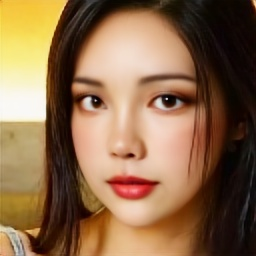 |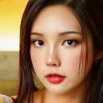 |  |
|  | | 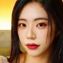 | 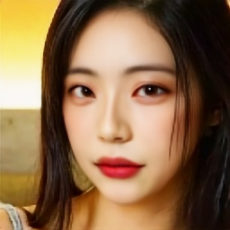 |  |  |
|  |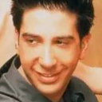 |  | 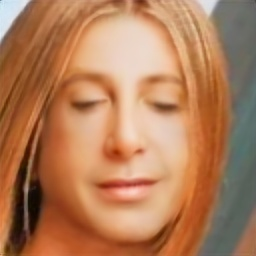 | 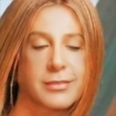 |  |

## Installation

```bash
git clone https://github.com/somanchiu/ReSwapper.git
cd ReSwapper
python -m venv venv

venv\scripts\activate

pip install -r requirements.txt

pip install torch torchvision --force --index-url https://download.pytorch.org/whl/cu121
pip install onnxruntime-gpu --force --extra-index-url https://aiinfra.pkgs.visualstudio.com/PublicPackages/_packaging/onnxruntime-cuda-12/pypi/simple/
```

## The details of inswapper

### Model architecture
The inswapper model architecture can be visualized in [Netron](https://netron.app). You can compare with ReSwapper implementation to see architectural similarities. Exporting the model with opset_version=10 makes it easier to compare the graph in Netron. However, it will cause issue #8.

We can also use the following Python code to get more details:
```python
model = onnx.load('test.onnx')
printable_graph=onnx.helper.printable_graph(model.graph)
```

The model architectures of InSwapper and SimSwap are extremely similar and worth paying attention to.

### Model inputs
- target: [1, 3, 128, 128] shape image in RGB format with face alignment, normalized to [0, 1] range
- source (latent): [1, 512] shape vector, the features of the source face, obtained using the ArcFace model.
    - Calculation of latent
        - The details of ArcFace model
            - Architecture: IResNet50
            - Input: [1, 3, 112, 112] shape image in RGB format with face alignment, normalized to [-1, 1] range
            - Output: [1, 512] shape vector
        - "emap" can be extracted from the original inswapper model.
        ```python
        from numpy.linalg import norm as l2norm

        input_mean = 127.5
        input_std = 127.5
        input_size = (112, 112)

        aimg, _ = face_align.norm_crop2(img, landmark=face.kps, image_size=input_size[0])

        blob = cv2.dnn.blobFromImages([aimg], 1.0 / input_std, input_size,
                                      (input_mean, input_mean, input_mean), swapRB=True)
        net_out = session.run(output_names, {input_name: blob})[0]

        embedding = net_out.flatten()

        normed_embedding = embedding / l2norm(embedding)

        latent = normed_embedding.reshape((1,-1))
        latent = np.dot(latent, emap)
        latent /= np.linalg.norm(latent)
        ```
    - It can also be used to calculate the similarity between two faces using cosine similarity.

### Model output
Model inswapper_128 not only changes facial features, but also body shape.

| Target | Source | Inswapper Output | Reswapper Output<br>(Step 429500) |
|--------|--------|--------|--------|
|  | | 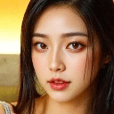 |  |

### Loss Functions
There is no information released from insightface. It is an important part of the training. However, there are a lot of articles and papers that can be referenced. By reading a substantial number of articles and papers on face swapping, ID fidelity, and style transfer, you'll frequently encounter the following keywords:
- content loss
- style loss/id loss
- perceptual loss

### Face alignment
Face alignment is handled incorrectly at resolutions other than 128. To resolve this issue, add an offset to "dst" in both x and y directions in the function "face_align.estimate_norm". The offset is approximately given by the formula: Offset = (128/32768) * Resolution - 0.5

## Training
<details open>

<summary>GAN Approach</summary>

See the [GAN branch](https://github.com/somanchiu/ReSwapper/tree/GAN)
</details>

<details open>

<summary>Supervised Learning Approach</summary>

### 0. Pretrained weights (Optional)
If you don't want to train the model from scratch, you can download the pretrained weights and pass model_path into the train function in train.py.

### 1. Dataset Preparation
Download [FFHQ](https://www.kaggle.com/datasets/arnaud58/flickrfaceshq-dataset-ffhq) to use as target and source images. For the swaped face images, we can use the inswapper output.

### 2. Model Training

Optimizer: Adam

Learning rate: 0.0001

Modify the code in train.py if needed. Then, execute:
```python
python train.py
```

The model will be saved as "reswapper-\<total steps\>.pth". You can also save the model as ONNX using the ModelFormat.save_as_onnx_model function. The ONNX model can then be used with the original INSwapper class.

All losses will be logged into TensorBoard.

Using images with different resolutions simultaneously to train the model will enhance its generalization ability. To apply this strategy, you can pass "resolutions" into the train function.

Generalization ability of the model trained with resolutions of 128 and 256:

| Output<br>resolution | 128 | 160 | 256 |
|--------|--------|--------|--------|
|Output|  |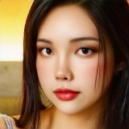 | |

Enhancing data diversity will improve output quality, you can pass "enableDataAugmentation" into the train function to perform data augmentation.

| Target | Source | Inswapper Output | Reswapper Output<br>(Step 1567500) | Reswapper Output<br>(Step 1399500) |
|--------|--------|--------|--------|--------|
|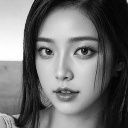|  |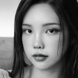 |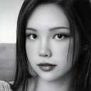 | 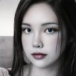 |

#### Notes
- Do not stop the training too early.

- I'm using an RTX3060 12GB for training. It takes around 12 hours for 50,000 steps.
- The optimizer may need to be changed to SGD for the final training, as many articles show that SGD can result in lower loss.
- To get inspiration for improving the model, you might want to review the commented code and unused functions in commit [c2a12e10021ecd1342b9ba50570a16b18f9634b9](https://github.com/somanchiu/ReSwapper/commit/c2a12e10021ecd1342b9ba50570a16b18f9634b9).

</details>

## Inference
```python
python swap.py
```

## Face Attribute Modification
The source embedding contains information about various facial attributes. Modifying the source enables adjustments to specific attributes.

### 1. Paired Datasets Collection
For example, modifying facial hair (Beard vs. No Beard):
```python
dataset_a = FaceAttribute.create_linear_direction_dataset("Beard or No Beared\\Train\\Beard", "beard.npy")
dataset_b = FaceAttribute.create_linear_direction_dataset("Beard or No Beared\\Train\\No Beard", "no_beard.npy")
```
### 2. Attribute Direction Calculation
```python
direction = FaceAttribute.get_direction(dataset_a, dataset_b, "direction.npy")
```

### 3. Source Embedding Modification
```python
direction = direction / np.linalg.norm(direction)
latent += direction * face_attribute_steps
```

Here is the output of Inswapper after modifying the source embedding

| face_attribute_steps | 0 (Original output) | 0.25 | 0.5  | 0.75 | 1.0 |
|--------|--------|--------|--------|--------|--------|
|beard_direction.npy||||||

## Pretrained Model
### 256 Resolution
- [reswapper_256-1567500.pth](https://huggingface.co/somanchiu/reswapper/tree/main)
- [reswapper_256-1399500.pth](https://huggingface.co/somanchiu/reswapper/tree/main)

### 128 Resolution
- [reswapper-1019500.pth](https://huggingface.co/somanchiu/reswapper/tree/main)
- [reswapper-1019500.onnx](https://huggingface.co/somanchiu/reswapper/tree/main)
- [reswapper-429500.pth](https://huggingface.co/somanchiu/reswapper/tree/main)
- [reswapper-429500.onnx](https://huggingface.co/somanchiu/reswapper/tree/main)

### Notes
If you downloaded the ONNX format model before 2024/11/25, please download the model again or export the model with opset_version=11. This is related to issue #8.

## Attribute Direction
- [beard_direction.npy
](https://huggingface.co/somanchiu/reswapper/tree/main/attributeDirection)

## To Do
- Create a 512-resolution model (alternative to inswapper_512)